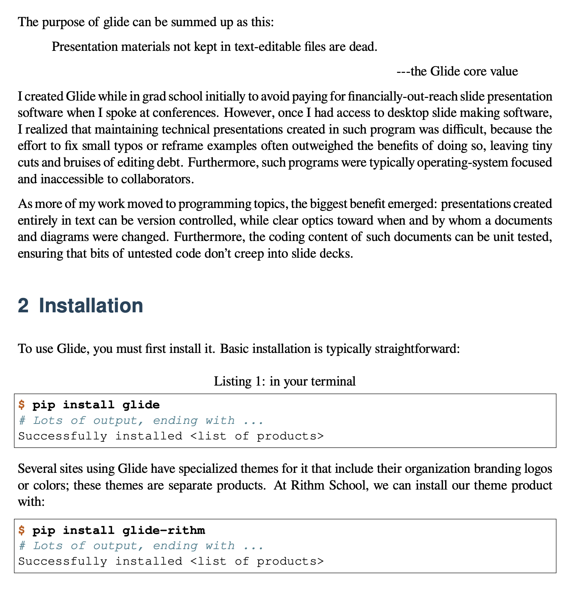

.. highlight:: rst

=====================
Introduction to Glide
=====================

.. |rst|  replace:: reStructuredText

.. meta::
    :description: Introduction to Glide document system, covering installation,
      and common usage.

:author: Joel Burton <joel@joelburton.com>
:version: |version|
:updated: |date|

This document provides an introduction to the :title:`Glide Document System`
and how to use it to create curriculum artifacts from source materials. It
focuses more on *using* the system, and does not attempt to be a comprehensive
guide to everything needed to author documents. That is covered elsewhere.

Glide source documents are meant to be read. You may find it useful to
examine the document creating this introduction, `which you can find here
<_sources/index.rst.txt>`_.

Introduction
============

Glide is system oriented for technical users to produce curriculum (both
document-oriented and slide-oriented) from source material. It can produce:

- HTML handouts

- HTML slides

- PDFs generated via `LaTeX`:term: or `Prince`:term:

The source materials can include:

- `reStructured Text <basic-rst>`:ref: *(the primary document type, explained below)*

- Images *(in many formats, including gif, png, jpg, and svg)*

- Source code

- Charts and diagrams in several different formats

- Other text documents

----

The purpose of glide can be summed up as this:

.. pull-quote::

   Technical materials not kept in text-editable,
   version-controllable files are dead.

.. index:: History

I created Glide while in grad school initially to avoid paying for
financially-out-reach slide presentation software when I spoke at conferences.
However, once I had access to desktop slide making software, I realized that
maintaining technical presentations created in such program was difficult,
because the effort to fix small typos or reframe examples often outweighed
the benefits of doing so, leaving tiny cuts and bruises of editing debt.
Furthermore, such programs were typically operating-system focused and
inaccessible to collaborators.

As more of my work moved to programming topics, the biggest benefit emerged:
presentations created entirely in text can be version controlled, while
clear optics toward when and by whom a documents and diagrams were changed
(for clarity of this idea, try using `git diff`:program: on a PowerPoint deck).
Furthermore, the coding content of such documents can be unit tested, ensuring
that bits of untested code don't creep into slide decks.

Installation
============

TODO aafigure npm i @mermaid-js/mermaid-cli

To use Glide, you must first install it. Basic installation is typically
straightforward.

.. code-block:: simple-console
   :class: console
   :caption: in your terminal

   $ pip install glide
   # Lots of output, ending with ...
   Successfully installed <list of products>

Several sites using Glide have specialized themes for it that include their
organization branding logos or colors; these themes are separate products. At
Rithm School, we can install our theme product with:

.. code-block:: simple-console
   :class: console

   $ pip install glide-rithm
   # Lots of output, ending with ...
   Successfully installed <list of products>

.. todo:: These commands won't work yet!

Optional Components
-------------------

For some users, that will be all the software that is needed. For some users,
there are additional pieces that should be installed.

LaTeX
~~~~~

.. .. sidebar:: Example of PDF

    .. image:: example.png

  Example of PDF.

To generate PDF documents, you'll need to have LaTeX installed. While this is
an easy install, LaTeX is a huge program, and installing it will take at least
a gigabyte of space.

A straightforward way to install LaTeX on a Mac is `MacTeX
<https://www.tug.org/mactex/mactex-download.html>`_.

I prefer to get as much of my software from package management systems, so I
install LaTeX via Macports; to do so, you'll need the following packages:

| texlive
| texlive-fonts-extra
| texlive-latex-extra

.. _matplotlib-overview:

Matplotlib
~~~~~~~~~~

To use charts and other kinds of technical, you can use `Matplotlib
<https://matplotlib.org/>`_ to write a program to generate the chart:

.. container:: compare

   .. code-block:: python
      :caption: source code
      :class: code-40c

      import numpy as np
      import matplotlib.pyplot as plt

      x = np.arange(0, 100000, 5000)
      plt.plot(x, x / 1000, 'bo')
      plt.ylabel('time', fontsize=20)
      plt.xlabel('size of list', fontsize=20)
      plt.title('pop()', fontsize=35)

   .. container::

      .. plot::
        :width: 13em

        import numpy as np
        import matplotlib.pyplot as plt

        x = np.arange(0, 100000, 5000)
        plt.plot(x, x / 1000, 'bo')
        plt.ylabel('time', fontsize=20)
        plt.xlabel('size of list', fontsize=20)
        plt.title('pop()', fontsize=35)

.. container:: align-left

    .. code-block:: python
      :caption: source code
      :class: unsized

      import numpy as np
      import matplotlib.pyplot as plt

      x = np.arange(0, 100000, 5000)
      plt.plot(x, x / 1000, 'bo')
      plt.ylabel('time', fontsize=20)
      plt.xlabel('size of list', fontsize=20)
      plt.title('pop()', fontsize=35)

.. plot::
    :width: 13em

    import numpy as np
    import matplotlib.pyplot as plt

    x = np.arange(0, 100000, 5000)
    plt.plot(x, x / 1000, 'bo')
    plt.ylabel('time', fontsize=20)
    plt.xlabel('size of list', fontsize=20)
    plt.title('pop()', fontsize=35)

.. _graphviz-overview:

Graphviz
~~~~~~~~

Graphviz is a program that turns text-based diagrammatic instructions into
attractive graphs, like this:

.. nope

    .. container:: compare

      .. container::

          .. code-block:: dot
            :caption: graphviz language
            :class: unsized

            digraph {
               aa -> { bb cc }
               bb -> d [style=dashed]
            }

      .. container::

          .. graphviz::
            :size: 10,2.6

            digraph {
              graph [ rankdir=LR ]
              aa -> { bb cc }
              bb -> d [style=dashed]
            }

Installing Graphviz is typically a straightforward process:

.. code-block:: simple-console
   :class: console

   $ brew install Graphviz     # if you use Homebrew
   $ brew install graphviz     # if you use MacPorts

.. important:: At Rithm, Graphviz is required!

   Almost half of our lectures and exercises use Graphviz (particularly those
   focusing in databases and data structures). You will need to get it installed
   to render any of these resources.

Rendering existing documents
============================

To render a curriculum asset, change to the directory of the asset and run one
of the generating commands. For example, to publish this document:

.. code-block:: simple-console
    :class: console

    $ cd glide/doc
    $ make handouts-open

This will generate the handouts-style artifact and open it in your default
browser for examination.

.. tip:: Not sure what the asset directory is?

    Glide assets always have two files in their directory, `Makefile`:file: and
    `index.rst`:file:. If you don't see these files, you may be either higher or
    lower in the directory tree than you should be.

For the curriculum assets at Rithm, it needs to know which cohort you are
building materials for, so if these are uploaded, it will put them in the
right folder on the server. Therefore, you should set an environmental variable,
:envvar:`RITHM_COHORT`:

.. code-block:: simple-console
    :class: console

    $ export RITHM_COHORT=r17

There are many other generation commands:

.. table:: Core Glide commands

    ========================== ================================================
    Command                    Outcome
    ========================== ================================================
    ``make handouts``          Generate handouts
    ``make handouts-open``     Generate handouts and open in browser
    ``make revealjs``          Generate slides
    ``make revealjs-open``     Generate slides and open in browser
    ``make latexpdf``          Generate PDF *(requires LaTeX installation)*
    ``make linkcheck``         Check that all URLs in asset are live
    ``make text``              Generate text version
    ========================== ================================================

A good place to begin is trying each of these commands on a curriculum asset
and investigating the results.

.. note:: Watching and Refreshing

    All of those commands test or generate things on your individual computer. It's
    common, as writing or editing curriculum, to constantly keep generating and
    viewing it, so my colleagues at Rithm, Tim and Matt, created a "watcher"
    system for this --- you need only run the generating command once, and it will
    continually refresh it in the browser while you work. To use this capability,
    you'll need to install `watchdog`:

    .. code-block:: simple-console
        :class: console

        $ python3 -m pip install watchdog

    Then, to generate and get constantly updated web views:

    .. code-block:: simple-console
        :class: console

        $ make watch-handouts   # for handouts, or
        $ make watch-revealjs   # for slides

    To stop the watching system, press :kbd:`Control-c` in the terminal.

Creating lecture demo archive
-----------------------------

Most of our lectures have a demo that is used during the lecture or where bits
of code are on slides. Such a demo is placed into a `.zip`:file: archive and shared
with the students. When working with our curriculum, you may find it useful to
use that zipfile, so that you can try out the demo exactly as a student would.

To do so, use the command `make demozip`:program:. That will take make a zip
archive of a folder at the top of the lecture titled `demo`.

Create exercise code archive
----------------------------

Similarly, almost all our exercises have starter code, and Glide makes a zipfile
for that, too. You can generate that zipfile to examine it with `make zip`:program:.
The generated file will contain everything in the exercise with a few
exceptions: it never includes things in a folder called `meta/`:file:, and never
includes restructured text files anywhere or useless things like Python
virtual environments of JavaScript `node_modules`:file:.

Most important, though, is that it doesn't include the solution for the
exercise: you can get that with `make soln`:program:.

The same commands work the same way for assessments --- the only difference is
that assessment solution zipfiles are password-protected; the students are
given that password only after every student has submitted their assessment.
The password is printed on your screen while building an assessment, so it can
be shared with students.

Uploading documents
-------------------

Glide is typically set up to upload to a centralized server.

Here at Rithm, we all share a single key for our server, in a file called
`rithm-curric-pem.txt`:file:. You should ask someone for that file, and then store
it in a directory in your home directory called `.ssh`:file:. Then, you can load that key
with `ssh-add`:program:, like so:

.. code-block:: simple-console
    :class: console

    $ ssh-add ~/.ssh/rithm-curric-pem.txt

(the `ssh-add`:program: command will remember that key until your computer is restarted;
you may find it useful to add that command to your shell profile, which for
most Mac users nowadays would be `{$HOME}/.zshrc`:file:.)

When you have this set up, you can upload an assert with `make upload`:program:.
That will generate the asset, if it has changed since last generation, and
upload all versions: slides, handouts, and zip files.

Creating a new document
=======================

In the future, there will be commands to create a new curriculum asset but, for
now, the best way is to simply copy an existing one and edit it:

.. code-block:: simple-console
    :class: console

    $ cp -a react-intro vue-intro
    $ cd vue-intro
    $ code index.rst

.. caution:: Be careful how you copy!

    In most Glide systems, the required `Makefile`:file: is kept centrally, and
    the version in each directory is just a *soft link* to it. If you copy
    a directory using ``cp -r`` or if you copy using the Finder, you will lose
    the linked nature of this file, which can cause problems maintaining the
    overall system.

    You can check that you have the right kind of setup like so:

    .. code-block:: simple-console
        :class: console

        $ ls -l
        total 152
        lrwxr-xr-x  1 joel  staff     11 Aug 26 16:53 Makefile@ -> ../Makefile
        -rw-r--r--  1 joel  staff  55441 Aug 26 16:53 components.jpg
        drwxr-xr-x  9 joel  staff    288 Aug 28 23:02 demo/
        -rw-r--r--  1 joel  staff  12577 Aug 26 16:53 index.rst
        -rw-r--r--  1 joel  staff   1837 Aug 26 16:53 react.svg

After making your new asset, try generating it with `make handouts`.

.. _basic-rst:

Basic restructured text
=======================

Restructured text is a markup system for text, similar to Markdown, but
considerably larger, more structured, and fully-featured. It is implemented
most commonly with the Python library `docutils` along with the program
`Sphinx`. Glide is a layer that sits above these, so you may find the
documentation of those products useful as you learn more about Glide.

This section does not attempt to be a comprehensive guide to restructured text.
For a deeper introduction, see `reStructured Text Primer
<https://www.sphinx-doc.org/en/master/usage/restructuredtext/basics.html>`_.

Basic markup
------------

Generally, input text becomes output text, with blank lines separating each
paragraph. There are common typographic conventions for inline markup:

.. container:: compare

    .. code-block:: rst
        :class: code-40c

        This paragraph has **bold** and
        *italic* elements.

        Also a `code name` and snippet of
        ``actual code``.

        You can make lovely em and en
        dashes---like this--or this.

    .. container::

        This paragraph has **bold** and
        *italic* elements.

        Also a `code name` and snippet of
        ``actual code``.

        You can make lovely em and en
        dashes---like this--or this.

.. note:: Differentiating these

    - *Italics* are used as is common in running text: for quoting
      an idea or introducing a new term ("this is called a
      *closure*"). This should not be used for coding elements like
      variable names, html tags, or such.

    - **Bold** should be used sparingly and for very important
      phrases to draw the readers' attention: ("this will **never**
      happen"). This should also not be used for coding elements.

    - `code name` is for variable names, file names, function names, and similar
      things. Some examples: "set the variable `x` on success" and
      "don't forget to call `evt.preventDefault()`" (our style is to
      put parentheses after a function or method name to indicate that
      it is a function or method; if this were the complete signature
      or was showing it being called with parameters, that should be
      an ``actual code``).

    - ``actual code`` should be for short snippets of, well, actual
      code: ``if x = 7`` and ``fluffy.dance("tango")``.

You can also use semantic colors. Be very sparing here.

.. container:: compare

    .. code-block:: rst
        :class: code-40c

        This will `delete all files`:danger:
        or, on a better day, it might just
        `send spam email`:warning:.

        It will `succeed`:success:
        but---sadly---`may not be
        useful`:muted:.

    .. container::

        This will `delete all files`:danger:
        or, on a better day, it might just
        `send spam email`:warning:.

        It will `succeed`:success:
        but---sadly---`may not be
        useful`:muted:.

Section headings
----------------

You can divide a document into section with section headings.

.. container:: compare

    .. code-block::
        :class: code-40c

        New section
        ===========

        Some text,
        and other stuff.

    .. container::

        .. rubric:: New section

        Some text, and other stuff.

For our documents, we have these headings:

.. code-block::
    :class: code-60c

    ==============
    Document title
    ==============

    There is only one of these, and it should be at the
    very top of the document.

    Main section
    ============

    This usually divides a lecture into topics, or divides
    an exercise into its largest parts.

    Minor section
    -------------

    This produces an individual slide, and is used for
    dividing parts of an exercise into sub-parts.

    Sub section
    +++++++++++

    We rarely use these, but sometimes long exercises need
    further sub-sections, and this is what we use for that.

Lists
-----

Much of our material is present as bulleted lists:

.. container:: compare

    .. code-block::
        :class: top-margin-1 code-40c

        - You can make lists

        - With lots of bullets

          - And nest lists in lists

            - And so on

        Also:

        1. Number lists, too

        2. Which can have children

           - Like so

    .. container::

        - You can make lists

        - With lots of bullets

          - And nest lists in lists

            - And so on

        Also:

        1. Number lists, too

        2. Which can have children

           - Like so

An important thing to note is that with reStructuredText, lists are *not*
indented initially. Note that the bullets or numbers start at the same
indentation of the surrounding text.

Glide also support definition lists, which we use frequently:

.. container:: compare

    .. code-block::
        :class: code-40c

        A term
            Along with the definition. Note
            that this comes immediately
            after the term; there cannot be
            a line there.

        Another term
            The definitions can be long.

            And divided into paragraphs.

        `Cat.dance()`
            How we can define a programming
            term.

    .. container::

        A term
            Along with the definition. Note
            that this comes immediately
            after the term; there cannot be
            a line there.

        Another term
            The definitions can be long.

            And divided into paragraphs.

        `Cat.dance()`
            How we can define a programming
            term.

Code and code-like markup
=========================

Parsed literal blocks
---------------------

It's common for us to show content that is in monospace, with a border, but
not written in any particular code language. This is often done to make line
art-style diagrams, with color or emphasized text.

For example, here is a diagram intended to show recursion:

.. parsed-literal::
   :class: unsized

           **n: []**  *base*    ⭣0
           `──────────────────`:red:
         **n: [1]**     3 + ⭡[] ⭣3
         `──────────────────────`:green:
       **n: [2,3]**      2 + ⭡[3] ⭣5
       `──────────────────────────`:blue:
     **n: [1,2,3]**     1 + ⭡[2,3] ⭣6
     `──────────────────────────────`:pink:
   **add([1,2,3])**              ⭡[1,2,3]
   ──────────────────────────────────

These are created using the `parsed-literal` directive, which the content in
a bordered box (we'll see the same style for programming code later). The
*parsed* term refers to the idea that you can use most |rst| formatting in
the block. Here is the source for the diagram above:

.. code-block::
   :class: unsized

    .. parsed-literal::
       :caption: source

               **n: []**  *base*    ⭣0
               `──────────────────`:red:
             **n: [1]**     3 + ⭡[] ⭣3
             `──────────────────────`:green:
           **n: [2,3]**      2 + ⭡[3] ⭣5
           `──────────────────────────`:blue:
         **n: [1,2,3]**     1 + ⭡[2,3] ⭣6
         `──────────────────────────────`:pink:
       **add([1,2,3])**              ⭡[1,2,3]
       ──────────────────────────────────

Code blocks
-----------

Glide can show syntax-highlighted code in several hundred programming languages,
thanks to Sphinx's use of `Pygments`, a code formatting system. To show code,
use a `code-block` directive, providing the language name, like so:

.. container:: compare

    .. code-block::
        :caption: source

        .. code-block:: js

            /** Add together x and y */

            function add(x, y) {
              // this part is tricky
              return x + y;
            }

    .. code-block:: js
        :caption: result

        /** Add together x and y */

        function add(x, y) {
          // this part is tricky
          return x + y;
        }

Some supported languages and file formats that we use:

.. hlist::
    :columns: 3

    - `css`
    - `docker`
    - `html+jinja`
    - `html`
    - `http`
    - `ini`
    - `js` `(JavaScript)`:small-muted:
    - `json`
    - `jsx`
    - `markdown`
    - `postgresql`
    - `python`
    - `text`
    - `toml` `(markup language)`:small-muted:
    - `ts` `(TypeScript)`:small-muted:
    - `yaml`
    - `zsh`

.. container:: small

  Full list at `Pygments Lexers <https://pygments.org/docs/lexers/>`_

.. tip:: Setting the default language

    It's common for a document to have lots of code blocks in the same language;
    in this case, you can set the language once, at the top, and then you can
    omit the language name:

    .. code-block::
        :class: code-40c

        .. highlight:: js

        { lots of other content }

        .. code-block::

            /** Add together x and y */

            function add(x, y) {
              // this part is tricky
              return x + y;
            }

    For blocks in other languages in that document, you can continue to specify
    those languages directly.

Emphasizing lines
~~~~~~~~~~~~~~~~~

To draw attention to particular lines, you can indicate this with
`emphasized-lines`; this can take one of more line numbers/ranges, joined with
commas:

.. container:: compare

    .. code-block::
        :caption: source

        .. code-block:: js
            :emphasize-lines: 1, 4-5

            /** Add together x and y */

            function add(x, y) {
              // this part is tricky
              return x + y;
            }

    .. code-block:: js
        :caption: result
        :emphasize-lines: 1, 4-5

        /** Add together x and y */

        function add(x, y) {
          // this part is tricky
          return x + y;
        }

.. math::

    r = \frac{\sum^n_{i=1}(x_i - \bar{x})(y_i - \bar{y})}{\sqrt{\Sigma^n_{i=1}(x_i - \bar{x})^2 \times \Sigma^n_{i=1}(y_i - \bar{y})^2}}

Or `n = {x}^2`:math: for inline.

Numbering lines
~~~~~~~~~~~~~~~

For some examples, it can be useful to number the lines, like so:

.. container:: compare

    .. code-block::
        :caption: source

        .. code-block:: js
            :linenos:

            /** Add together x and y */

            function add(x, y) {
              // this part is tricky
              return x + y;
            }

    .. code-block:: js
        :caption: result
        :linenos:

        /** Add together x and y */

        function add(x, y) {
          // this part is tricky
          return x + y;
        }

You can combine emphasized lines and numbered lines freely.

Changing font size or number of columns
~~~~~~~~~~~~~~~~~~~~~~~~~~~~~~~~~~~~~~~

Code blocks default to a smaller font, fitting 80 characters across (except
for side-by-side code, where it fits 40 across). In some cases, you may want to
override one or both of these.

You can change the font size with a class of `.code-{n}`:samp:, where `n` is a
number indicating the size (100 is the default, so 120 would be 120% of that
size). You can change the number of columns with a class of `.code-{n}c`:samp:,
where `n` is the number of columns.

.. container:: compare

    .. code-block::
        :caption: source

        .. code-block:: js
            :class: .code-120 .code-30c

            /** Add together x, y */

            function add(x, y) {
              // this part is tricky
              return x + y;
            }

    .. code-block:: js
        :caption: result
        :class: .code-120 .code-30c

        /** Add together x, y */

        function add(x, y) {
          // this part is tricky
          return x + y;
        }

You can also use these classes with `parsed-literal` blocks; here is a more
attractive and smaller version of our recursion example:

.. container:: compare

    .. code-block::
        :class: code-43c

        .. parsed-literal::
           :class: code-90 code-35c

                   **n: []**  *base*    ⭣0
                   `──────────────────`:red:
                 **n: [1]**     3 + ⭡[] ⭣3
                 `──────────────────────`:green:
               **n: [2,3]**      2 + ⭡[3] ⭣5
               `──────────────────────────`:blue:
             **n: [1,2,3]**     1 + ⭡[2,3] ⭣6
             `──────────────────────────────`:tan:
           **add([1,2,3])**              ⭡[1,2,3]
           ──────────────────────────────────

    .. parsed-literal::
       :class: code-90 code-35c

               **n: []**  *base*    ⭣0
               `──────────────────`:red:
             **n: [1]**     3 + ⭡[] ⭣3
             `──────────────────────`:green:
           **n: [2,3]**      2 + ⭡[3] ⭣5
           `──────────────────────────`:blue:
         **n: [1,2,3]**     1 + ⭡[2,3] ⭣6
         `──────────────────────────────`:tan:
       **add([1,2,3])**              ⭡[1,2,3]
       ──────────────────────────────────

Console sessions
----------------

To show examples of console work, we have a special class that can be applied
to `parsed-literal` or `code-block` elements: ``console``. It draws a thicker
and rounded border, to make it easy for the reader to understand
that this is an interaction with the console, and not merely a file or some
bit of example code.

For example, here is this class applied to a new code highlighting,
`simple-console`. This formatting automatically color syntax highlights
to differentiate between the shell prompt, the entered commands, the resulting
output, and any comments.

.. container:: compare

    .. code-block:: rst

        .. code-block:: simple-console
            :class: console

            $ python -m venv venv
            (venv) $ pip install -r reqs.txt
            # Lots of output here ...
            Installed foo==1.0 bar==2.0

    .. code-block:: simple-console
        :class: console

        $ python -m venv venv
        (venv) $ pip install -r reqs.txt
        # Lots of output here ...
        Installed foo==1.0 bar==2.0

.. tip:: Shell highlighting is not 100% perfect

    The algorithm for determining how to successfully highlight the session can be
    fooled, particularly in trying to guess what is a comment. If the highlighting
    isn't correct, you can style your console session by hand using a
    `parsed-literal` directive instead and using the CSS class names that
    the code highlighter would have used.

    For example, the shell highlighter would have mistake the ``#`` in the
    first line as starting a comment and gotten the formatting wrong. Instead,
    here the correct output is forced, albeit tediously:

    .. container:: compare

        .. code-block:: rst
            :class: code-35c

            .. code-block:: simple-console
                :class: console

                `$`:gp: `echo "#Hi!"`:gs:
                `$`:gp: `# A comment`:c:

        .. container::

            .. parsed-literal::
                :class: console highlight code-35c

                `$`:gp: `echo "#Hi!"`:gs:
                `$`:gp: `# A comment`:c:

Other console interactions
~~~~~~~~~~~~~~~~~~~~~~~~~~

Of course, there are console programs besides the shell. You can also apply
the console class to other code languages, to show nicely syntax highlighted
interactions.

For example, here is an interaction with `psql`:

.. code-block:: psql
    :class: console

    psql (12.4)
    Type "help" for help.

    joel=# \c jobly
    You are now connected to database "jobly" as user "joel".
    jobly=# SELECT first_name FROM users;
    +------------+
    | first_name |
    +------------+
    | Test       |
    | Test       |
    +------------+
    (2 rows)

    jobly=# -- enter your next command here

Here are some useful code block "languages" to use for this:

- `pycon`: Python console

- `pytb`: Python tracebacks

- `psql`: PostgreSQL prompt

- `node`: NodeJS `(planned in the works!)`:green:

If just want to show a plain console interaction, you can always use either
the code block language `text` or a `parsed-literal`.

Add captions to code
--------------------

It is often helpful to indicate the file for some example code, or other provide
some context for it. You can add a caption to code like this:

.. container:: compare

    .. code-block:: rst

        .. code-block:: python
            :caption: example.py

            if name == "joel":
                print "hi"

    .. code-block:: python
        :caption: example.py

        if name == "joel":
            print "hi"

.. only:: not revealjs

  It's our style to use this for the filenames of demo files
  or if some explanation is needed of where this code is coming from.

Including code in files
-----------------------

Whenever possible, don't inline code---it's too easy for it to have bugs!

Instead, keep the code in a separate file, so we can test it and include as
demo code.

.. container:: compare

    .. code-block:: rst

        .. literalinclude:: demo/include.py
            :language: python

    .. literalinclude:: demo/include.py
        :language: python

Now, since Glide knows the name of the code file, if you want to provide a
caption with the file path, you can provide an empty argument for caption, and
it will fill in the file path.

.. container:: compare

    .. code-block:: rst

        .. literalinclude:: demo/include.py
            :language: python
            :caption:

    .. literalinclude:: demo/include.py
        :language: python
        :caption:

Of course, to provide a specific caption for that code block, you can instead
provide whatever you'd like for the `caption` argument.

Finding Things
~~~~~~~~~~~~~~

Rather than having to break up our code files based on which parts we'd like to
show in our documents, you can indicate which lines to include by specifying
one or more lines/ranges:

.. container:: compare

    .. code-block:: rst

        .. literalinclude:: demo/include.py
          :language: python
          :lines: 1, 3-4

    .. literalinclude:: demo/include.py
      :language: python
      :lines: 1, 4-5

For Python code, rather than using line numbers, you can provide the name of
a Python "object" (any function or class will do), and only that will be shown:

.. container:: compare

    .. code-block:: rst

        .. literalinclude:: demo/include.py
          :language: python
          :pyobject: Cat

    .. literalinclude:: demo/include.py
      :language: python
      :pyobject: Cat

That is both easier and less prone to breakage when lines get added or removed
from files.

Unfortunately, that feature is limited to Python; however, you can also select
which parts of the code appear with `start-at` and `end-at`. For example,
imagine we want to show the `if`:code: block in this code:

.. literalinclude:: demo/start-at.js
  :language: js
  :class: unsized
  :linenos:

We do so by matching any part of line 4 and the closing curly brace of line 7,
like so:

.. container:: compare

    .. code-block:: rst

        .. literalinclude:: demo/start-at.js
          :language: js
          :start-at: gameOver
          :end-at: }

    .. literalinclude:: demo/start-at.js
      :language: js
      :start-at: gameOver
      :end-at: }

Those lines were indented in the original source but might look a bit odd here,
where the indendtation is out of context. You can add or subtract indentation
using `indent` or `dedent`:

.. container:: compare

    .. code-block:: rst

        .. literalinclude:: demo/start-at.js
          :language: js
          :start-at: gameOver
          :end-at: }
          :dedent: 2

    .. literalinclude:: demo/start-at.js
      :language: js
      :start-at: gameOver
      :end-at: }
      :dedent: 2

That took more work that just using line numbers, but it's generally better,
since the code-to-show selection is more likely to survive any refactoring of
the original code.

.. tip:: Matching hard-to-match parts of the code

    There are times when it's tricky or impossible to match the code using
    `start-at` or `end-at`. Therefore, there are two other potential matchers,
    `start-after` and `end-before`. They can be useful if it's easier to match
    the lines before or after the ones you want to show.

    That may not be enough for all cases: imagine we wanted to show just the
    function `checkWinner()` in our code (without cheating and using line
    numbers): we can't match on a close curly brace because that will match the
    one on line 7, rather than the one on line 8.

    A trick we often use is to insert marker comments for start-matching-after
    and stop-matching-before. In order to not drown out the code in markers,
    use something short and unobtrusive. Here's a version of that file,
    marked up so it's easier to match code from it:

    .. literalinclude:: demo/start-after.js
      :language: js
      :class: code-40c

    We can now find those matching symbols:

    .. container:: compare

        .. code-block:: rst
            :class: code-45c

            .. literalinclude:: demo/start-after.js
              :language: js
              :start-after: //>
              :end-before: //<

        .. literalinclude:: demo/start-after.js
          :language: js
          :start-after: //>
          :end-before: //<

Images
======

Images
------

You can add an image with the `image` directive:

.. container:: compare

    .. code-block::

        .. image:: porcupine.jpg

    .. image:: porcupine.jpg
        :width: 10em

Glide will handle PNG, GIF, JPG, and SVG images.

It does not scale the images by default so it's common to scale the image
by supplying either a height or width. This can be in any CSS-like format
(so things like ``px`` and ``%`` would work), but it's best to use ``em``.
It's very common to want a small image in the handouts and a larger one
on the slides. Since the slides have a larger em size naturally, this is a
good unit.

.. container:: compare

    .. code-block::

        .. image:: porcupine.jpg
          :width: 7em

    .. image:: porcupine.jpg
        :width: 7em

Images can be given a caption:

.. container:: compare

    .. code-block::

        .. figure:: porcupine.jpg
          :width: 7em

          *Hystrix cristata* in native
          environment.

    .. figure:: porcupine.jpg
        :width: 7em

        *Hystrix cristata* in native environment.

For images without good definition, you can add a border:

.. container:: compare

    .. code-block::

        .. image:: porcupine.jpg
          :width: 7em
          :class: image-border

    .. image:: porcupine.jpg
        :width: 7em
        :class: image-border

For less-important images that should appear in slides and on-screen handouts,
but not when handouts are printed, use the `noprint` class:

.. container:: compare

    .. code-block::

        .. image:: porcupine.jpg
          :width: 7em
          :class: noprint

    .. container::

        `(Nothing shown on printout)`:muted:

Notes, sidebars, and topics
===========================

Notes
-----

Notes are for less-important information; we often use this to indicate that
something doesn't need to be understood during a lecture. They do not appear
in slides.

.. note:: Class-based components

    Until 2020, it was common for components to be written with
    classes, rather than functions.

Sidebars
--------

Sidebars are useful for an "aside" conversation related to the main piece
of content. Visually, they appear in a narrow column to the left of the main
content. These only appear in handouts.

An good use of these is sidebar-next-to-code:

.. sidebar:: Lightly implemented

  Note that that isn't a very complete implementation: it should include
  methods for things like finding the number of items in the `ODict`,
  creating an `ODict` with an initial set of values, and so on.

  It does,
  however, highlight the two important points: it's easy to build this implementation,
  and it suffers from O(n) when deleting items from the `ODict`.

.. code-block:: python
   :class: code-90 code-65c

   class OrderedDict(object):
       """Ordered dictionary, built from dictionary and list."""

       def __init__(self):
           self._dict = {}
           self._list = []

       def get(self, key):
           """Get a key. O(1)."""

           return self._dict.get(key)  # O(1)

       def set(self, key, value):
           """Set a key. O(1)."""

           if key not in self._dict:   # O(1)
               self._list.append(key)  # O(1)
           self._dict[key] = value     # O(1)

       def delete(self, key):
           """Remove a key. O(n)."""

           del self._dict[key]         # O(1)
           self._list.remove(key)      # O(n)  <-- :(

Topics
------

Topics are for backstories or side-journeys. These tend to be longer than a
note or sidebar. For example:

.. topic:: The history of React

    React was invented in 1962 by Walt Disney, decades before
    JavaScript was invented.

    { much more here }

Hints
-----

Provide hints using the admonition `hint`:

.. container:: compare

    .. code-block:: rst

        .. hint:: Picking the data structure

            Use a dictionary!

    .. hint:: Picking the data structure

        Use a dictionary!

Of course, there may be times when it would give away the game to show everyone
the hint immediately. You can add a `hover-reveal` class to any element that takes class
names to make the element initial obscured until the reader wants a hint.

.. container:: compare

    .. code-block:: rst

        .. hint:: Picking the data structure

          This is the hardest part; roll over
          the box below if you'd like a hint.

          .. container:: hover-reveal

            Use a dictionary!

    .. hint:: Picking the data structure

      This is the hardest part; roll over
      the box below if you'd like a hint.

      .. container:: hover-reveal

        Use a dictionary!

It wasn't really a surprise: dictionaries are usually the answer.

Tables
======

Standard Table
--------------

====================== =========== =========== =========== ============ ============
Data Structure         Get         Add         Delete      Iterate      Memory
====================== =========== =========== =========== ============ ============
Tree                   `O(n)`:red: O(1)        O(1)        O(1)         `*`:green:
Binary Search Tree     O(log n)    `O(n)`:red: `O(n)`:red: O(1)         `*`:green:
Dictionary (Hash Map)  O(1)        O(1)        O(1)        `O(n)`:red:  `**`:orange:
Set (Hash Map)         O(1)        O(1)        O(1)        `O(n)`:red:  `**`:orange:
OSet (HashMap+DLL)      O(1)       O(1)        O(1)        O(1)         `***`:red:
ODict (HashMap+DLL)     O(1)       O(1)        O(1)        O(1)         `***`:red:
====================== =========== =========== =========== ============ ============

Arranging Columns
-----------------

Can center columns other than first:

.. rst-class:: td-center

  ====================== =========== =========== =========== ============ ============
  Data Structure         Get         Add         Delete      Iterate      Memory
  ====================== =========== =========== =========== ============ ============
  Tree                   `O(n)`:red: O(1)        O(1)        O(1)         `*`:green:
  Binary Search Tree     O(log n)    `O(n)`:red: `O(n)`:red: O(1)         `*`:green:
  ====================== =========== =========== =========== ============ ============

Can right justify columns other than first:

.. rst-class:: td-right

  ====================== =========== =========== =========== ============ ============
  Data Structure         Get         Add         Delete      Iterate      Memory
  ====================== =========== =========== =========== ============ ============
  Tree                   `O(n)`:red: O(1)        O(1)        O(1)         `*`:green:
  Binary Search Tree     O(log n)    `O(n)`:red: `O(n)`:red: O(1)         `*`:green:
  ====================== =========== =========== =========== ============ ============

Right Columns
-------------

Can right-justify columns other than first:

.. rst-class:: td-right

  ====================== =========== =========== =========== ============ ============
  Data Structure         Get         Add         Delete      Iterate      Memory
  ====================== =========== =========== =========== ============ ============
  Tree                   `O(n)`:red: O(1)        O(1)        O(1)         `*`:green:
  Binary Search Tree     O(log n)    `O(n)`:red: `O(n)`:red: O(1)         `*`:green:
  Dictionary (Hash Map)  O(1)        O(1)        O(1)        `O(n)`:red:  `**`:orange:
  Set (Hash Map)         O(1)        O(1)        O(1)        `O(n)`:red:  `**`:orange:
  OSet (HashMap+DLL)      O(1)       O(1)        O(1)        O(1)         `***`:red:
  ODict (HashMap+DLL)     O(1)       O(1)        O(1)        O(1)         `***`:red:
  ====================== =========== =========== =========== ============ ============

CSV Tables
----------

.. table:: Whee
    :class: red align-right

    .. csv-table::
        :header: Name,Age

        Ezra,11
        Auden,12

It's certainly aesthetically pleasing to look at |rst| source files and see
tables meticulously hand-drawn---but they are rather tedious to make. In many
cases, it will be easier to just describe your data as comma-separated values,
like so:

.. table:: Whee
    :class: red

    .. csv-table::
        :header: Name,Age

        Ezra,11
        Auden,12

Containers
==========

Containers
----------

The `container` directive just adds a div.

.. container::

  Boring!

This is useful if you want to put a class on it:

.. container:: someclass

  Now I have `someclass` on my `div`

.. newslide::

Can put class on without a div with `rst-class`:

.. rst-class:: someclass

This para has `someclass`

.. rst-class:: someclass

  Each of these paras

  Has `someclass`, independently

Comparing Things
================

Comparing Things
----------------

Instead of just one thing:

.. code-block:: js

      if (name == "joel")
          console.log("hi");

Side-by-side comparisons are useful:

.. container:: compare

  .. container::

    .. code-block:: js

          if (name == "joel")
              console.log("hi");

  .. container::

    .. code-block:: python

      if name == "joel":
          print "hi"

.. newslide::

.. container:: compare

  .. container::

    The spacing should look right even if we lead with compare, or
    if the compares are textual.

  .. container::

    .. code-block:: python

      if name == "joel":
          print "hi"

    .. code-block:: python

      if name == "joel2":
          print "hi"

Only
====

Only
----

To have things only appear on slides:

.. only:: revealjs

  This only appears on slides

To have things not appear on slides, but everywhere else:

.. only:: not revealjs

  This does not appear on slides.

  Don't ever say "only:: handouts"---since we have other possible
  non-slide formats (LaTeX, epub, etc). Always say "only:: not revealjs".

Slides
======

describe br

Speaker Notes
-------------

You can add speaker notes with the `speaker` directive. These appear in "speaker notes" view
(press **S** in revealjs). This never appears on handouts.

.. nope

    .. speaker::

  Example speaker note.

Commonly overlooked
===================

Glossary
========

.. glossary::

  LaTeX
    LaTeX is a powerful typesetting system that is used by Glide to generate
    our PDFs (LaTeX itself can be used to create many other kinds of documents;
    this is just what we use from it).

  Prince
    A commercial HTML to PDF converter.

